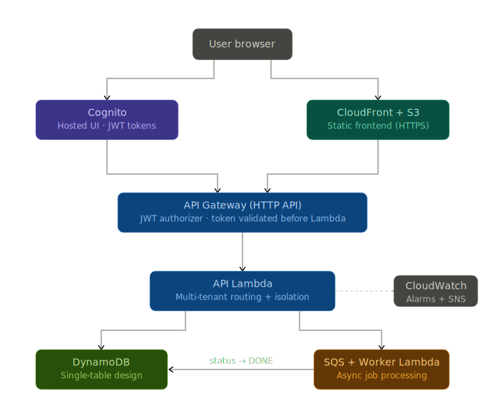

# Serverless SaaS Template (AWS + Terraform)

A production-shaped, cost-efficient **serverless SaaS starter** on AWS built with **Terraform**.

It gives you a working baseline for most SaaS products:

- ✅ Authentication (Cognito Hosted UI)
- ✅ JWT-secured API (API Gateway HTTP API)
- ✅ Multi-tenant data model (DynamoDB single-table pattern)
- ✅ Async background jobs (SQS + worker Lambda)
- ✅ Static frontend hosting (S3 + CloudFront HTTPS)
- ✅ CI plan + scheduled drift detection (GitHub Actions + OIDC)
- ✅ Monitoring + alerts (CloudWatch dashboard/alarms + SNS email)

---

## What this template does

### SaaS capabilities

- Users sign up and log in via **Cognito Hosted UI**
- A **tenant workspace** is automatically created on first login — no manual setup required
- Tenant admins can invite other users by email: `POST /tenant/invite` (admin-only)
- Tenant-scoped items:
  - `POST /items` → creates an item with status `PENDING`, enqueues a job to SQS
  - Worker Lambda consumes SQS and updates item status → `DONE`
  - `GET /items` lists items scoped to your tenant

### Multi-tenant model (DynamoDB single-table)

| Record | PK | SK | Attributes |
|---|---|---|---|
| Tenant | `TENANT#<tenant_id>` | `META` | name, owner_sub, created_at |
| Membership | `USER#<cognito_sub>` | `TENANT` | tenant_id, role |
| Item | `TENANT#<tenant_id>` | `ITEM#<item_id>` | text, status, created_at |

Each user's data is fully isolated by tenant — a user can never read or write another tenant's items. Isolation is enforced server-side on every request via membership validation.

---

## Architecture



---

## Key engineering choices

### Cost-efficient by design
- **No NAT Gateway** — all Lambdas run outside a VPC. NAT Gateways cost ~$32/month
  at minimum plus data transfer. For a serverless API with no private RDS/ElastiCache
  dependency, For this architecture, VPC adds cost and latency without meaningful benefit,
  since all services are AWS-managed (DynamoDB, SQS, Cognito) and accessed over IAM-authenticated HTTPS.
- **No RDS / OpenSearch / EKS** — these carry a minimum hourly cost regardless of
  traffic. DynamoDB on-demand scales to zero, making it ideal for unpredictable or
  low-volume SaaS workloads in early stages.
- **HTTP API over REST API** — ~70% cheaper than API Gateway REST API, with native
  JWT authorizer support. REST API's extra features (usage plans, request validation,
  caching) are not needed here.
- **Single-table DynamoDB** — one table handles tenants, memberships, and items.
  Reduces operational overhead, keeps costs predictable, and models access patterns
  directly rather than relying on joins.

### Security-minded defaults
- **JWT validated at the gateway** — tokens are verified by API Gateway before the
  Lambda is invoked, keeping auth logic out of application code and reducing attack
  surface.
- **Tenant isolation enforced server-side** — the frontend sends an `X-Tenant-Id`
  header, but the Lambda validates membership in DynamoDB on every request. The
  client is never trusted to scope its own data access.
- **Admin identity via SSM, not Cognito groups** — avoids coupling authorization
  logic to Cognito-specific constructs. The admin email is a secret stored in
  Parameter Store, making it easy to rotate without redeploying.
- **GitHub Actions OIDC** — short-lived, role-scoped credentials per run. No static
  AWS keys stored in GitHub Secrets, eliminating a common credential leak vector.

### Operational readiness
- **Structured JSON logging** — every Lambda emits structured logs with `request_id`,
  `tenant_id`, and `user_sub`. This makes logs queryable in CloudWatch Insights
  without parsing freeform strings.
- **Drift detection** — a scheduled GitHub Actions workflow runs `terraform plan
  -detailed-exitcode` and opens a GitHub Issue if infrastructure has drifted from
  state. Catches manual console changes before they cause incidents.
- **Alarms on the right signals** — Lambda error rate, Lambda throttles, and SQS
  `ApproximateAgeOfOldestMessage`. The SQS age alarm catches worker failures that
  don't surface as Lambda errors (e.g. silent queue backup).

### Known omissions (intentional for a starter template)
- No WAF — recommended before exposing to public traffic at scale
- No multi-environment promotion pipeline — a `prod` environment would use the same
  modules with stricter IAM and a separate state backend
- No token refresh logic — access tokens expire after 1 hour; a production frontend
  would use the refresh token to obtain new credentials silently

### Cost expectations

At low usage, this architecture can run close to $0/month.

Typical costs come from:
- API Gateway requests
- Lambda execution time
- DynamoDB on-demand reads/writes
- CloudFront data transfer

There are no fixed infrastructure costs (no NAT Gateway, RDS, or EKS),
making it suitable for early-stage products or side projects.

### Tradeoffs

This template prioritizes simplicity, low cost, and fast iteration.

Tradeoffs include:
- No strong isolation between tenants (single-table model vs. per-tenant tables/accounts)
- No private networking (no VPC)
- Limited API features (HTTP API instead of REST API)

These choices are intentional for early-stage SaaS, but should be revisited as scale or compliance requirements grow.

---

## Demo (2 minutes)

**1. Deploy the template** (see [Deploy](#deploy-in-your-own-aws-account) below)

**2. Open the frontend** — the CloudFront URL is printed by `terraform output`

**3. Sign up** using the Cognito Hosted UI — a tenant workspace is created automatically

**4. Create an item** — watch it transition `PENDING` → `DONE` as the worker Lambda processes it

**5. Demonstrate tenant isolation** — open a second browser (incognito) and sign up as a different user. Each user sees only their own items, with their own isolated tenant ID.

### API (curl)

Export your access token first:
```bash
export TOKEN=<your_access_token>
export API_URL=<your_api_gateway_url>   # from terraform output
export TENANT_ID=<your_tenant_id>       # returned by GET /me
```

Check your identity:
```bash
curl -s "$API_URL/me" \
  -H "Authorization: Bearer $TOKEN"
```

Create an item:
```bash
curl -s -X POST "$API_URL/items" \
  -H "Authorization: Bearer $TOKEN" \
  -H "content-type: application/json" \
  -H "X-Tenant-Id: $TENANT_ID" \
  -d '{"text":"hello from the template"}'
```

List items:
```bash
curl -s "$API_URL/items" \
  -H "Authorization: Bearer $TOKEN" \
  -H "X-Tenant-Id: $TENANT_ID"
```

---

## Repository structure

```
infra/
  bootstrap/                  # one-time: creates remote state bucket + lock table
  environments/dev/           # deployable environment (uses remote backend)
services/
  api/                        # API Lambda (Python)
  worker/                     # Worker Lambda (Python)
  health/                     # health check Lambda (Python)
frontend/
  index.html                  # single-page UI using Cognito Hosted UI login
.github/workflows/
  terraform-dev.yml           # CI: fmt/validate/plan via OIDC
  terraform-drift-dev.yml     # scheduled drift detection + opens/updates GitHub Issue
```

---

## Deploy in your own AWS account

### Prerequisites

- Terraform >= 1.6
- AWS CLI configured (`aws sts get-caller-identity`)
- GitHub repo *(optional, for CI)*

### 1) Bootstrap remote state *(one-time)*

```bash
cd infra/bootstrap
terraform init
terraform apply
```

### 2) Configure variables

Create `infra/environments/dev/terraform.tfvars` (this file is gitignored — never commit it):

```hcl
admin_email = "your@email.com"
```

This email identifies the admin user. Create a matching user in Cognito after deploy.

### 3) Configure backend

Update `infra/environments/dev/backend.tf` with the bootstrap outputs (bucket, lock table, region), then:

```bash
cd infra/environments/dev
terraform init -reconfigure
terraform apply
```

### 4) Verify outputs

```bash
terraform output
```

### 5) Create the admin user in Cognito

```bash
aws cognito-idp admin-create-user \
  --user-pool-id <USER_POOL_ID> \
  --username your@email.com \
  --user-attributes Name=email,Value=your@email.com Name=email_verified,Value=true \
  --temporary-password "TempPass123!" \
  --region <YOUR_REGION>

aws cognito-idp admin-set-user-password \
  --user-pool-id <USER_POOL_ID> \
  --username your@email.com \
  --password "YourPermPass123!" \
  --permanent \
  --region <YOUR_REGION>
```

---

## CI / Drift Detection

### CI Plan (GitHub Actions)

- Runs `terraform fmt`, `validate`, and `plan` on every push to `infra/**`
- Uses OIDC with a plan-only role: `ReadOnlyAccess` + backend state permissions

### Drift Detection

- Scheduled workflow runs `terraform plan -detailed-exitcode`
- If drift is detected, it opens/updates a GitHub Issue and uploads the plan output as an artifact

---

## Monitoring

| Resource | Details |
|---|---|
| **Dashboard** | `saas-dev-dashboard` (CloudWatch → Dashboards) |
| **Alarms** | Lambda errors/throttles, SQS oldest message age |
| **Notifications** | SNS email *(confirm the subscription email after deploy)* |
